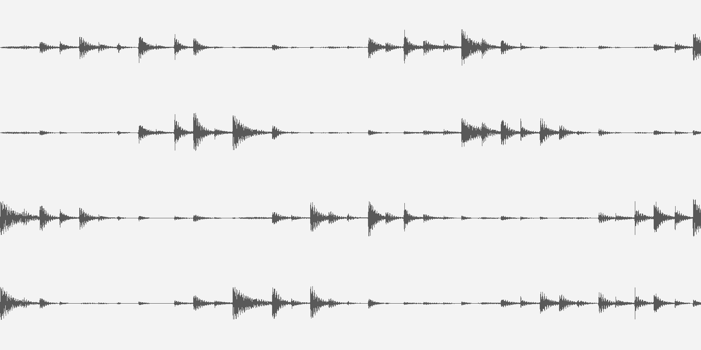
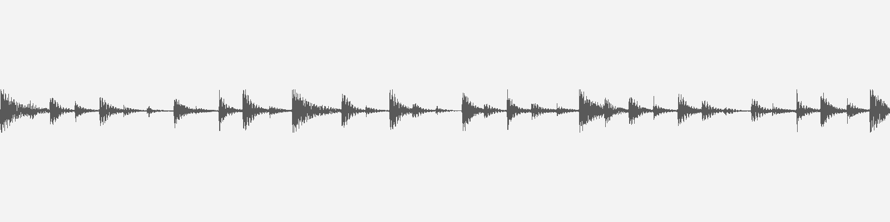
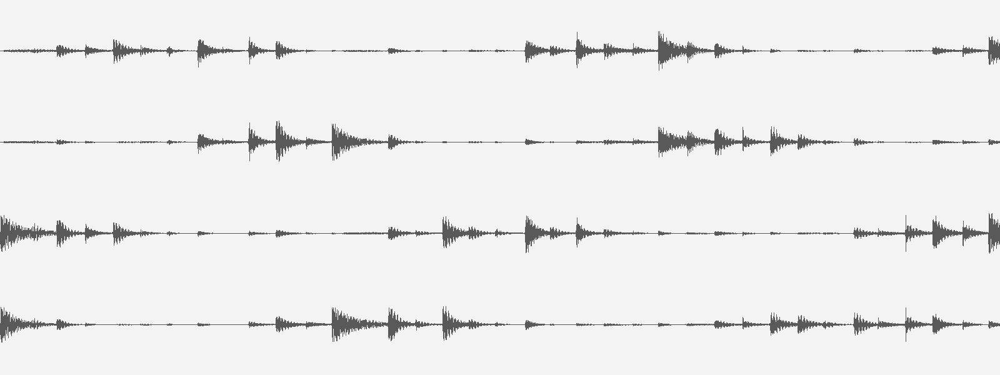
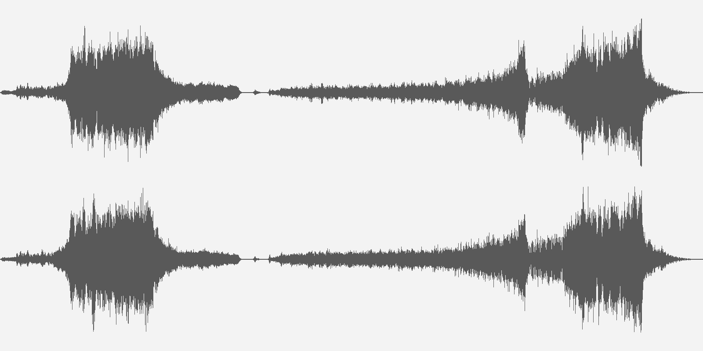
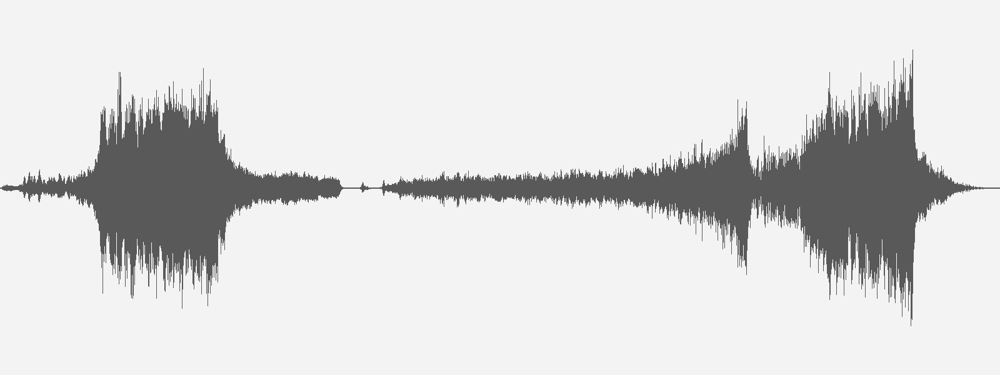
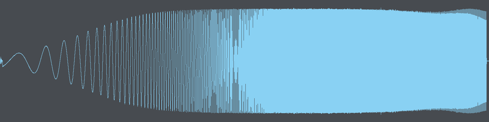
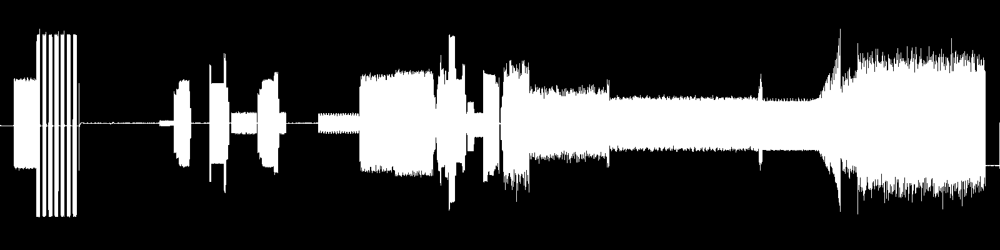

**Name**

    waveform - generates a png image of the waveform of a given audio file.

**Synopsis**

    waveform [options]

**Description**

    Waveform uses ffmpeg and libpng to read an audio file and output a png
    image of the waveform representing the audio file's contents.

    The fidelity of the produced waveform will be determined by the
    dimensions of the output png. Larger images will have more waveform
    detail than smaller images. To preserve waveform fidelity, you can
    have this program output a large image that is then rescaled using
    another program, such as ImageMagick.

    By default, the image will render a waveform for each channel of the
    audio file with the height of the image determined by the number of
    channels in the input file.

**Options**

    -i FILE
            Input file to parse. Can be any format/codec that can be read by
            the installed ffmpeg.

    -o FILE
            Output file for PNG. If -o is omitted, the png will be written
            to stdout.

    -m
            Produce a single channel waveform. Each channel will be averaged
            together to produce the final channel. The -h and -t options
            behave as they would when supplied a monaural file.

    -h NUM
            Height of output image. The height of each channel will be
            constrained so that all channels can fit within the specified
            height.

            If used with the -t option, -h defines the maximum height the
            generated image can have.

            If all tracks can have a height of -t with the final image being
            below the height defined by -h, the output image will have a
            height of -t multiplied by the number of channels in the input
            file. If not, the output image will have a height of -h.

    -t NUM [default 64]
            Height of each track in the output image. The final height of the
            output png will be this value multiplied by the number of channels
            in the audio stream.

            If you use the -t option together with the -h option, the final
            output will use -t if all tracks can fit within the height
            constraint defined by the -h option. If they can not, the track
            height will be adjusted to fit within the -h option.

    -w NUM [default 256]
            Width of output PNG image

    -c HEX [default 595959ff]
            Set the color of the waveform. Color is specified in hex format:
            RRGGBBAA or 0xRRGGBBAA

    -b HEX [default ffffffff]
            Set the background color of the image. Color is specified in hex
            format: RRGGBBAA or 0xRRGGBBAA.

Dependencies:
====

    ffmpeg 2.1.1
        - libavformat 55.19.104
        - libavcodec 55.39.101
        - libavutil 52.48.101
    libpng 1.5.18

Examples:
====

Fixed height per channel
-------
    ./waveform -i drumpan.wav -t 200 -w 1600 -b f3f3f3ff

This example takes a four-channel audio file of a drum beat panning between all channels and renders it giving each channel a dedicated 200 pixels of height.

Reduce to monaural
----
    ./waveform -i drumpan.wav -h 400 -w 1600 -m -b f3f3f3ff

Here we take the same four-channel file from above and reduce all channels into a single waveform by averaging the values of all the samples across all channels.

Fixed height image
----
    ./waveform -i drumpan.wav -h 600 -w 1600 -b f3f3f3ff

Again, the four-channel file, but rendered to constrain the entire output image to 600 pixels high, giving about 150 pixels of height to each channel.

Specify max image height
----
If you're not sure how many channels will be in the input file and want to make sure that no image generated will exceed a certain height, you can combine the -t and -h options to achieve this. if there is enough height defined by -h to draw each channel with the height specified by -t, each channel will be -t tall with the overall image being less than -h. However, if there are more channels than would fit within -h, -h will be used and each channel will be scaled down to fit inside an image of height -h.

Calling waveform with the following options on a stereo file produces the following:

    ./waveform -i parachute.mp3 -h 800 -t 600 -w 1600 -b f3f3f3ff

Notice that since this was a stereo file and 600 * 2 > 800, the final image size is restricted to 800 pixels. However, if we make the same call supplying a mono mix of the same file, the output image has a height of 600, since 600 * 1 / 2 < 800.

    ./waveform -i parachute_mono.mp3 -h 800 -t 600 -w 1600 -b f3f3f3ff

More examples:
----

    ./waveform -i 1hz-10khz-sweep.flac -h 400 -w 1600 -m -c 89d1f3ff -b 474b50ff

    ./waveform -i dialup.wav -h 400 -w 1600 -c ffffffff -b 000000ff

